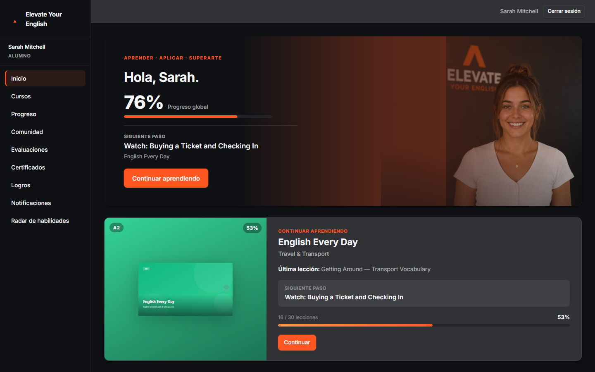
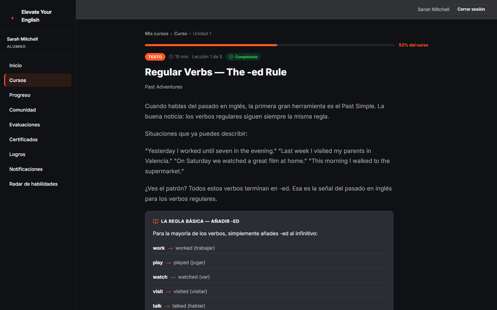
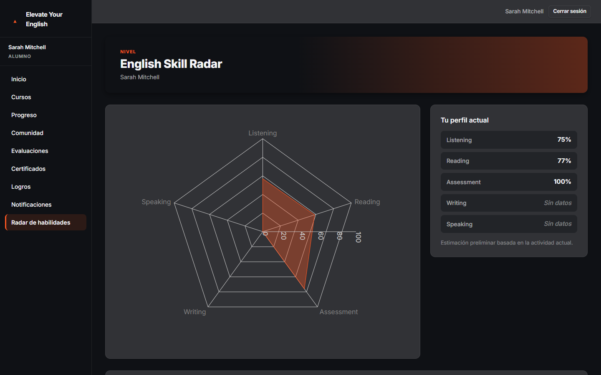
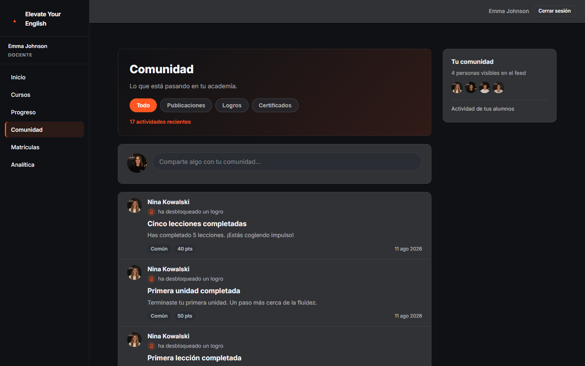
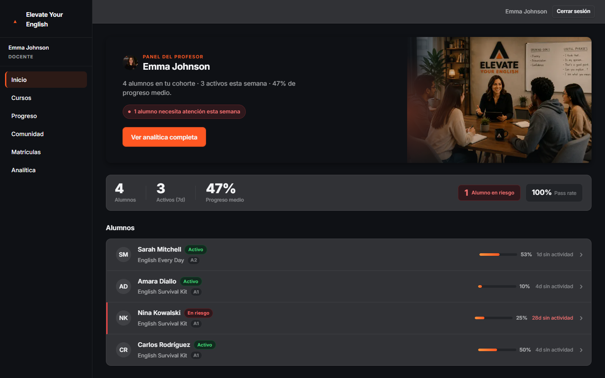
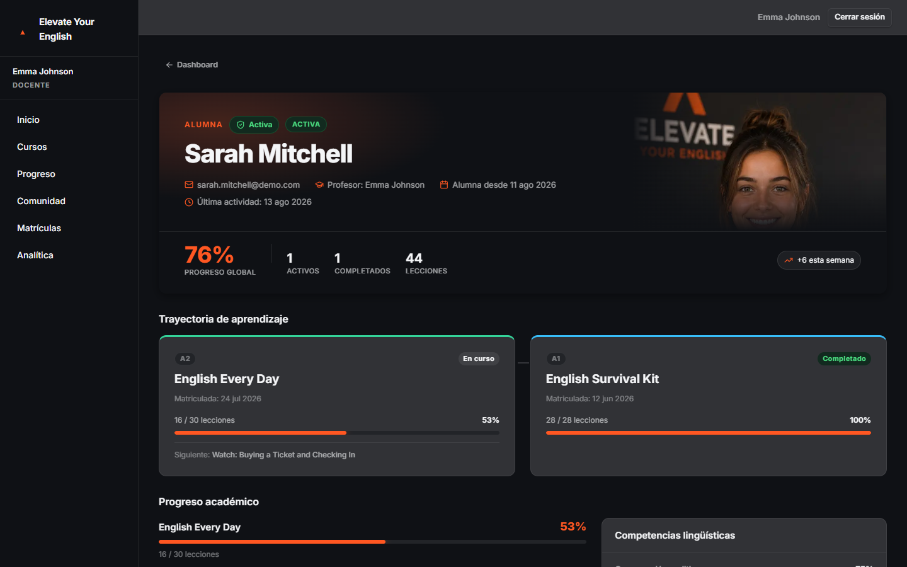
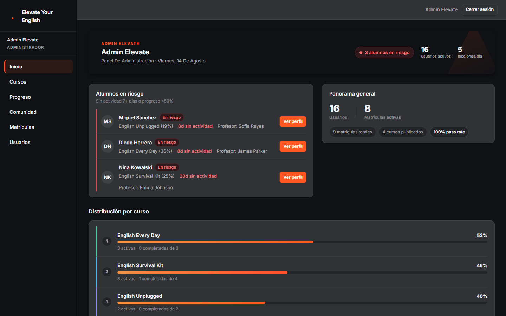

# Elevate Your English — Campus LMS

A full-stack Learning Management System (LMS) built as a portfolio project. It demonstrates role-based access control (Admin / Teacher / Student), a nested course hierarchy with sequential lesson unlocking, an assessment engine with attempt tracking, certificate generation, and a responsive, accessible frontend built on a custom Design System — all wired to a real REST API with no mocking.

---

## Table of Contents

- [Overview](#overview)
- [Product Tour](#product-tour)
- [Features](#features)
- [Architecture](#architecture)
- [Roles & Permissions](#roles--permissions)
- [Technical Highlights](#technical-highlights)
- [Project Structure](#project-structure)
- [Technical Decisions](#technical-decisions)
- [How to Run](#how-to-run)
- [Production](#production)
- [Seed Credentials](#seed-credentials)
- [API Reference Summary](#api-reference-summary)
- [Stack Summary](#stack-summary)

---

## Overview

Elevate Your English Campus is a full-stack LMS for English-language learning — not a CRUD demo, but a product with three genuinely different experiences behind real role-based access control: **Student** (courses, progress, assessments, Community), **Teacher** (cohort management, analytics, moderation), and **Admin** (academy-wide oversight). It ties together a full LMS content hierarchy (courses → units → lessons) with sequential unlock, an assessment engine with attempt tracking, certificate issuance, role-specific analytics, and a Community feed that unifies achievements, certificates, and social posts into one timeline.

The project was built module by module, with each API contract verified against the live backend before implementation — no assumptions, no mocking. The frontend follows a versioned internal Design System (CSS Modules + design tokens), with a dedicated pass on accessibility (semantic HTML, `aria-*` attributes, keyboard navigation, screen-reader-only text).

**Live Demo:** [elevate-campus-six.vercel.app](https://elevate-campus-six.vercel.app) · **API:** [elevate-backend-7ma5.onrender.com/api](https://elevate-backend-7ma5.onrender.com/api) · **Swagger:** [elevate-backend-7ma5.onrender.com/api/docs](https://elevate-backend-7ma5.onrender.com/api/docs)

Demo credentials for all three roles are listed below in [Seed Credentials](#seed-credentials). The backend may take a few seconds to respond on the first request after a period of inactivity.

---

## Product Tour

### 1. Student Dashboard
Personalized progress at a glance — overall completion, the next lesson to continue, and the active course, computed server-side.



### 2. Learning Experience
The Course → Unit → Lesson hierarchy in practice: real pedagogical content, lesson type and duration, and per-lesson progress.



### 3. Skill Radar
A per-skill competency breakdown (listening, reading, writing, speaking, assessment score), rendered with Recharts.



### 4. Community
A cohort feed unifying achievements, certificates, and posts from a student's classmates into a single timeline.



### 5. Teacher Dashboard
Cohort overview for a teacher: roster, at-risk indicators, and weekly analytics for their own students only.



### 6. Student Detail
A single staff-facing view aggregating a student's profile, progress, and learning trajectory — scoped to the viewer's role.



### 7. Admin Dashboard
Academy-wide oversight: at-risk students across every cohort and a platform-level summary.



---

## Features

### Student

- **Dashboard** — 9-block home view: hero, "continue where you left off", today's activity, weekly goals, learning path, recommendations, "today at Elevate", skills overview. Dedicated skeleton, empty and completed-course states.
- **Courses** — catalog with tabs (all / in progress / completed / available), client-side search, per-course visual identity.
- **Course Detail → Units → Lessons** — units and lessons rendered in order, with sequential unlock enforcement (a lesson stays locked until the previous one is completed, and unit N+1 requires unit N's lessons **and** its assessment to be passed).
- **Assessments** — per-unit quiz with a maximum attempt count, per-question feedback after submission, attempt history table, and contextual CTA after passing.
- **Progress** — global summary, 7/30-day growth, per-course progress, recent activity, language-skill breakdown.
- **Certificates** — list of issued certificates with PDF download (binary response) and embedded QR code.
- **Achievements** — unlockable badges (10 seeded) by category/rarity.
- **Notifications** — personal notification feed.
- **Skill Radar** — radar chart (listening / reading / writing / speaking / assessment score) built with Recharts.
- **Community** — cohort feed (posts, achievements, certificates, plus global announcements), create posts, comment on posts, delete their own posts/comments. Sees announcements published by their teacher and by admin.

### Teacher

- **Teacher Analytics** — cohort comparison table, inactivity ranking, per-assessment breakdown (pass rate, average score/attempts), and a per-student weekly trend panel.
- **Roster & Enrollments** — cohort dashboard with a per-student roster (progress, at-risk flag), and read access to their students' enrollments.
- **Student Detail** — individual student profile page (`/users/:id`), scoped to their own cohort, including that student's achievements and certificates.
- **Community** — feed scoped to their own cohort, create posts, comment, publish announcements visible to their cohort, and moderate (delete) any post/comment within their cohort.

### Admin

- **Users** — list all users, activate/deactivate accounts.
- **Enrollments** — create enrollments and manage their lifecycle (activate/suspend), academy-wide.
- **Students at Risk** — academy-wide list of inactive / low-progress students, surfaced on the admin dashboard.
- **Student Detail** — individual student profile page (`/users/:id`) for any student, including that student's achievements and certificates.
- **Community** — global feed (no cohort filter), publish global announcements, and moderate (delete) any post/comment academy-wide.

### Cross-cutting

- **Responsive Navigation** — collapsible Sidebar (desktop/tablet), fixed BottomNav + MobileMenu (mobile), full keyboard support (`Escape` to close, focus trapping/restoration, `aria-expanded`/`aria-controls`).
- **Toast System** — global `useToast()` (`showSuccess` / `showError` / `showInfo`) for async action feedback.
- **Design System** — CSS Modules + a shared token set (color, radius, spacing, shadows, z-index, typography) documented in `frontend/src/styles/globals.css`; shared components (`Button`, `Card`, `PageHeader`, `ProgressBar`, `LoadingState`, `ErrorState`, `EmptyState`, `Toast`).
- **Accessibility** — semantic status icons (icon + screen-reader-only text instead of color/emoji alone), `role="alert"` on form errors, table `<caption>` + `scope="col"` on data tables, accessible navigation (see above).

### Backend modules available (no dedicated frontend UI yet)

The following backend modules are implemented and routed (`/api/...`) but are **not yet surfaced as a page** in the current frontend: `bookings`, `availability`, `recommendations` (a frontend service stub exists but no page consumes it), `live-sessions`, `attendance`, `assignments`, `submissions`. These are not part of the current user-facing product — listed here for completeness, not as active features.

---

## Architecture

```
┌────────────────────────────────────────────────────────────┐
│                        Browser                             │
│                                                            │
│  Next.js 16 (App Router) — React 19 — CSS Modules          │
│  Port 3000                                                 │
└────────────────────┬───────────────────────────────────────┘
                     │  HTTP / JSON  (Authorization: Bearer)
┌────────────────────▼───────────────────────────────────────┐
│                    Express API                             │
│                                                            │
│  Node.js — Express 4 — JWT — express-validator              │
│  Port 4000                                                  │
│                                                            │
│  Modules: auth · users · courses · units · lessons          │
│           enrollments · progress · assessments               │
│           dashboard · teacher-analytics · achievements        │
│           certificates · notifications · recommendations      │
│           bookings · availability · live-sessions             │
│           attendance · assignments · submissions               │
│           community                                            │
└────────────────────┬───────────────────────────────────────┘
                     │  Mongoose ODM
┌────────────────────▼───────────────────────────────────────┐
│                    MongoDB                                 │
│  Collections: users · courses · units · lessons             │
│               enrollments · lessonProgress                   │
│               assessments · assessmentAttempts                │
│               achievements · certificates · notifications      │
└────────────────────────────────────────────────────────────┘
```

### Frontend layers

```
src/
├── app/
│   ├── (auth)/login/                    — Public login page
│   └── (protected)/                     — Route group with auth guard
│       ├── layout.js                    — Sidebar + Navbar + BottomNav shell
│       ├── dashboard/
│       ├── courses/[id]/units/[unitId]/lessons/[lessonId]/
│       ├── courses/[id]/units/[unitId]/assessment/
│       ├── assessments/
│       ├── progress/
│       ├── certificates/
│       ├── achievements/
│       ├── notifications/
│       ├── skill-radar/
│       ├── teacher-analytics/
│       ├── enrollments/
│       ├── community/
│       └── users/
│           └── [id]/                    — Student Detail (admin/teacher, cohort-scoped)
├── components/
│   ├── auth/LoginForm/
│   ├── layout/Sidebar/ · Navbar/ · BottomNav/ · MobileMenu/ · ProtectedLayout/
│   ├── dashboard/student/                — DashboardSkeleton, LearningPathCard, etc.
│   ├── teacher-analytics/                — CohortComparisonTable, InactivityRanking, ...
│   ├── community/                        — CommunityComposer, PostCard
│   ├── achievements/ · notifications/ · skill-radar/
│   └── ui/                               — Button, Card, PageHeader, ProgressBar,
│                                            LoadingState, ErrorState, EmptyState, Toast
├── contexts/ToastContext.js              — Global toast notifications
├── core/context/AuthContext/             — Global auth state
├── hooks/
│   ├── useAuth.js                        — Context consumer with guard
│   └── useAsyncData.js                   — Fetch/loading/error/reload hook
├── lib/
│   ├── api.js                            — Generic fetch wrapper
│   └── services/                         — One service file per resource
└── styles/                               — globals.css (design tokens) + CSS Modules
```

---

## Roles & Permissions

| Capability | Admin | Teacher | Student |
|---|:---:|:---:|:---:|
| View all users, activate/deactivate | ✓ | — | — |
| View all enrollments | ✓ | — | — |
| View courses | ✓ | ✓ | ✓ (published only) |
| View units & lessons | ✓ | ✓ | ✓ (sequential unlock applies to students) |
| Access lesson content | ✓ | ✓ | ✓ (if not locked) |
| View assessments / submit attempt | ✓ (view) | ✓ (view) | ✓ (submit, if lessons completed) |
| View own progress / dashboard | — | — | ✓ |
| Teacher Analytics (cohort, inactivity, breakdown) | — | ✓ (own cohort) | — |
| Certificates, Achievements, Notifications, Skill Radar (own) | — | — | ✓ |
| Student Detail page (`/users/:id`) | ✓ (any student) | ✓ (own cohort only) | — |
| Achievements / Certificates by student (`/students/:studentId`) | ✓ (any student) | ✓ (own cohort only) | — |
| Community: view feed | ✓ (academy-wide) | ✓ (own cohort) | ✓ (own cohort) |
| Community: create post | — | ✓ | ✓ |
| Community: comment on a post | ✓ | ✓ | ✓ |
| Community: create announcement | ✓ (academy-wide) | ✓ (own cohort) | — |
| Community: delete/moderate content | ✓ (any post/comment) | ✓ (own cohort's posts/comments only) | ✓ (own posts/comments only) |
| Sidebar: "Usuarios" link | ✓ | — | — |

Lessons for students are **sequentially locked**: a student cannot access lesson N+1 until lesson N is completed. Unit N+1 requires all of unit N's lessons completed **and**, if the unit has an assessment, that assessment passed.

---

## Technical Highlights

### JWT Authentication

The backend issues a signed JWT on login (`POST /api/auth/login`), with a different token TTL per role (`JWT_TTL_ADMIN`, `JWT_TTL_TEACHER`, `JWT_TTL_STUDENT`). The frontend stores it in React state via `AuthContext` — no `localStorage`, no cookies. Every authenticated request sends `Authorization: Bearer <token>` via the generic `api.js` wrapper.

### Role-Based Access Control

RBAC is enforced at two levels:

- **Backend**: middleware (`verifyToken`, `requireRole`, `requireActiveUser`) blocks unauthorized or inactive-user requests before they reach controllers. Teacher-scoped endpoints additionally check `student.assignedTeacherId === teacherId`.
- **Frontend**: protected routes redirect unauthenticated users to `/login`; the Sidebar conditionally renders role-specific links (`Usuarios` for admin, student-only links for students).
- **Cohort-scoped authorization**: there is no `Cohort` model — a teacher's cohort is implicit via `User.assignedTeacherId`. The same scoping rule (`validateTeacherScope` / `resolveScopeTeacherId`) is reused across Student Detail, Achievements/Certificates by student, and Community, so a teacher's data access is consistently limited to their own students everywhere, not just in one module.
- **Backend as source of truth**: the frontend only decides whether to *show* an action (e.g. a delete button in Community) — every permission is re-verified server-side, so no client-side state can grant access the API itself wouldn't allow.

### Nested LMS Structure & Sequential Unlock

Content is hierarchical: `Course → Unit → Lesson`, with an assessment per unit. API routes reflect this nesting (e.g. `GET /api/courses/:courseId/units/:unitId/lessons/:lessonId`). Lock state is computed server-side (`progressCalculator.isLessonLocked`) and returned per lesson/unit so the frontend never has to re-derive it.

### Assessment Engine with Attempts

Each unit has at most one assessment. Questions store `correctIndex` server-side — **excluded from the GET response** (students never see the answer). On submit, the backend verifies active enrollment, completed lessons, and remaining attempts before scoring and persisting an immutable `AssessmentAttempt`. The submit payload is `{ answers: [index0, index1, ...] }` — one integer per question, in order.

### Certificates (PDF + QR)

On 100% course completion, an enrollment is marked completed and a certificate is issued. `certificatePdf.service.js` generates the PDF (via `pdfkit`) with an embedded QR code (via `qrcode`) for verification. Download is a binary response (`res.blob()` on the frontend, not JSON).

### Dashboard Aggregation

`GET /api/dashboard/student` aggregates summary stats, 7/30-day growth, per-course enrollments with next-lesson pointers, recent activity, pending assessments, and a skill-progress breakdown — computed server-side via Mongoose aggregation pipelines, avoiding N+1 queries from the frontend.

### Community: Unified Feed, Moderation & Rate Limiting

The feed unifies three heterogeneous sources — achievements, certificates, and posts/announcements — into a single normalized, paginated timeline, rather than three separate endpoints the frontend would have to merge itself. Posts and comments use **soft delete** (`isDeleted: true`, never a physical delete). Deletion permission follows the same rule everywhere: the author always can, admin always can, a teacher only within their own cohort. All three write endpoints (`POST /posts`, `POST /posts/:postId/comments`, `POST /announcements`) share a single rate limiter — **100 requests / 15 min / IP** — mounted after `verifyToken`, so an unauthenticated request never consumes quota.

### I18N at the Source

Achievement/certificate notifications and the achievement catalog are generated in Spanish directly in the backend, not translated client-side. An idempotent, dry-run-by-default script (`backend/src/scripts/migrateNotificationStrings.js`) backfills any notifications persisted before that change, without ever running automatically.

### Responsive Navigation & Accessibility

Sidebar (desktop/tablet, backdrop + `Escape` to close), BottomNav + MobileMenu (mobile), all with focus management (focus moves into the panel on open, returns to the trigger on close), `aria-expanded`/`aria-controls`/`aria-haspopup`. Status indicators that would otherwise rely on color or emoji alone (e.g. lesson completed/locked/available) pair the icon with an `aria-hidden` flag and a screen-reader-only text equivalent.

---

## Project Structure

### Backend modules

```
src/modules/
├── auth/              — login, logout, token verification
├── users/             — CRUD + activate/deactivate
├── courses/           — CRUD + status lifecycle (draft → published → archived)
├── units/             — nested under courses
├── lessons/           — nested under units, sequential locking for students
├── assessments/        — quiz CRUD + attempt submission + attempt history
├── enrollments/         — enroll, activate, suspend
├── progress/            — per-lesson completion + overview
├── dashboard/            — role-specific dashboard aggregation
├── teacher-analytics/     — cohort comparison, inactivity, weekly trend
├── achievements/          — unlockable badges
├── certificates/           — PDF + QR generation on course completion
├── notifications/          — personal notification feed
├── recommendations/        — backend-only, no frontend page yet
├── bookings/               — backend-only, out of current LMS scope
├── availability/            — backend-only, out of current LMS scope
├── live-sessions/            — backend-only, out of current LMS scope
├── attendance/                — backend-only, out of current LMS scope
├── assignments/                — backend-only, out of current LMS scope
├── submissions/                 — backend-only, out of current LMS scope
└── community/                    — feed, posts, comments, announcements, cohort moderation
```

Each module follows the same structure: `routes → controller → service → repository`. `src/scripts/` holds standalone maintenance scripts (idempotent, `--apply`-gated) run manually against the database — not part of the request/response path.

### Frontend services

```
src/lib/services/
├── auth.service.js
├── courses.service.js
├── units.service.js
├── lessons.service.js
├── enrollments.service.js
├── progress.service.js
├── users.service.js
├── assessments.service.js
├── dashboard.service.js
├── teacher-analytics.service.js
├── achievement.service.js
├── certificate.service.js
├── notification.service.js
├── community.service.js
└── recommendation.service.js   — defined, not yet consumed by any page
```

Each service is a plain object with methods that call `api.js`. No class instantiation, no state.

---

## Technical Decisions

### Generic API wrapper (`api.js`)

All HTTP calls go through a single `request()` function that attaches `Content-Type`/`Authorization` headers, parses JSON, and throws a typed `Error` with `data.message` on non-2xx responses. Every service is a thin layer of named calls — auth headers and error handling aren't repeated per endpoint. Binary responses (certificate PDF) bypass this wrapper with a raw `fetch` + `res.blob()`, since `api.js` always parses JSON.

### Handling inconsistent API contracts

During development, several API response shapes required verification against the live backend rather than assumption, e.g.:

| Endpoint | Envelope key |
|---|---|
| `GET /api/progress/overview` (student) | `{ overview: [...] }` |
| `GET /api/progress/students/:id` (admin/teacher) | `{ progress: [...] }` — same shape, different key |
| `PATCH /api/progress/lessons/:id/complete` | No envelope — fields returned directly |
| Submit assessment attempt | `{ answers: [index0, index1, ...] }`, not objects |

Each was confirmed by hitting the live backend before writing the consuming page — contract-first, no guessing.

### Client-side route protection

Protected routes check auth state on mount; unauthenticated users are redirected to `/login` before protected content renders, avoiding a flash of content.

### Active navigation link

Sidebar/BottomNav use `usePathname()` and mark a link active on `pathname === href || pathname.startsWith(href + '/')`, so navigating into a nested route (e.g. `/courses/[id]/units/...`) keeps the parent link highlighted.

### Design tokens over hardcoded values

Frontend surfaces built early in the project (e.g. admin/teacher tables) originally used hardcoded hex colors and pixel radii. These were normalized to reference the shared token set in `globals.css` (`--bg-surface`, `--text-secondary`, `--radius-lg`, etc.) so all surfaces — not just the student-facing ones — stay visually consistent as the Design System evolves.

---

## How to Run

### Prerequisites

- Node.js ≥ 18
- MongoDB running locally, or via the provided `docker-compose.yml`

### 1. Backend

```bash
cd backend
npm install
```

Create `backend/.env` (see `backend/.env.example`):

```env
PORT=4000
NODE_ENV=development

MONGODB_URI=mongodb://localhost:27017/elevate_campus

JWT_SECRET=cambia_este_valor_en_produccion
JWT_TTL_ADMIN=8h
JWT_TTL_TEACHER=24h
JWT_TTL_STUDENT=7d

CLIENT_URL=http://localhost:3000
```

Run the seed (**only runs when `NODE_ENV=development`**):

```bash
npm run seed
```

This creates: 1 admin, 3 teachers, 12 students (3 cohorts, one per teacher), 4 published courses (A1–B2) with their units/lessons/assessments, and a 10-item achievement catalog. It does **not** create enrollments or lesson progress — those are created afterward via the Enrollments module (admin-only) or by exercising the app.

Start the server:

```bash
npm run dev     # nodemon (development)
npm start       # node (production)
```

The API will be available at `http://localhost:4000/api`. Swagger docs at `http://localhost:4000/api/docs`.

Run the backend test suite (Jest + Supertest + `mongodb-memory-server`, no real database needed):

```bash
npm test        # 27 suites / 353 tests
```

### 2. Frontend

```bash
cd frontend
npm install
```

Create `frontend/.env.local`:

```env
NEXT_PUBLIC_API_URL=http://localhost:4000/api
```

Start the dev server:

```bash
npm run dev
```

Open `http://localhost:3000`. The root redirects to `/login`.

Lint and build:

```bash
npm run lint     # ESLint — 0 errors (some pre-existing warnings)
npm run build    # next build — production build
```

### 3. Docker (backend + MongoDB only)

```bash
docker-compose up
```

Spins up the Express API (port 4000) and a MongoDB 7 instance with a healthcheck. The frontend is not containerized — run it locally with `npm run dev` against the dockerized API.

---

## Production

| Layer | Provider | URL |
|---|---|---|
| Frontend | Vercel | https://elevate-campus-six.vercel.app |
| Backend API | Render | https://elevate-backend-7ma5.onrender.com/api |
| Database | MongoDB Atlas | — |

### Configuration

- **Frontend**: a single build-time variable, `NEXT_PUBLIC_API_URL`, set in Vercel's Production environment to the Render API URL above. Any `NEXT_PUBLIC_*` variable is inlined into the Next.js client bundle at build time — it is public by design, never a place for secrets.
- **Backend**: configured entirely through environment variables, validated at boot (`config/env.js` exits the process if any is missing) — `PORT`, `NODE_ENV`, `MONGODB_URI`, `JWT_SECRET`, `JWT_TTL_ADMIN`, `JWT_TTL_TEACHER`, `JWT_TTL_STUDENT`, `CLIENT_URL`. Values are set directly in Render's dashboard; secrets never live in the frontend or in this repository.
- **CORS**: the API allows exactly one origin, read from `CLIENT_URL` (`app.use(cors({ origin: env.clientUrl, credentials: true }))`) — in production this is set to the Vercel frontend URL above.
- **Database**: MongoDB Atlas is used as the production database. Connection string, cluster, and credentials are private and are not documented here.

This repository is hosted on GitHub (`origin`). Whether Render and/or Vercel are configured for automatic deploy-on-push cannot be confirmed from the repository itself — no `render.yaml` or `vercel.json` is committed, and that configuration lives in each provider's dashboard — so it is not asserted here.

The backend can take a few seconds to respond to the first request after a period of inactivity.

---

## Seed Credentials

After running `npm run seed` in the backend:

| Role | Email | Password |
|---|---|---|
| Admin | admin@elevate.com | Admin2024! |
| Teacher | emma.johnson@elevate.com | Teacher2024! |
| Teacher | james.parker@elevate.com | Teacher2024! |
| Teacher | sofia.reyes@elevate.com | Teacher2024! |
| Student (12 total, `@demo.com`) | e.g. sarah.mitchell@demo.com | Student2024! |

Students are split into 3 cohorts (4 each), one per teacher (`assignedTeacherId`). All seeded accounts are `isActive: true`. No enrollments are pre-seeded — a fresh database has courses and users but no student progress until enrollments are created.

---

## API Reference Summary

| Method | Endpoint | Auth | Description |
|---|---|---|---|
| POST | `/api/auth/login` | — | Obtain JWT |
| POST | `/api/auth/logout` | Bearer | Invalidate session |
| GET | `/api/users` | Admin, Teacher (own cohort) | List users |
| GET | `/api/users/:id` | Admin, Teacher (own cohort) | Student Detail |
| PATCH | `/api/users/:id/activate` \| `/deactivate` | Admin | Toggle user account |
| GET | `/api/courses` | Bearer | List courses (students see published/enrolled only) |
| GET | `/api/courses/:id/units` | Bearer | Units for a course |
| GET | `/api/courses/:id/units/:uid/lessons/:lid` | Bearer | Lesson detail |
| PATCH | `/api/progress/lessons/:id/complete` | Student | Mark lesson completed |
| GET | `/api/progress/courses/:id` \| `/overview` | Student | Course / global progress |
| GET | `/api/courses/:id/units/:uid/assessment` | Bearer | Assessment for a unit |
| POST | `/api/courses/:id/units/:uid/assessment/attempts` | Student | Submit attempt |
| GET | `/api/enrollments` | Bearer | List enrollments |
| PATCH | `/api/enrollments/:id/activate` \| `/suspend` | Admin | Enrollment lifecycle |
| GET | `/api/dashboard/student` \| `/teacher` \| `/admin` | Bearer (per role) | Role-specific dashboard aggregation |
| GET | `/api/teacher-analytics/*` | Teacher | Cohort, inactivity, breakdown, weekly trend |
| GET | `/api/achievements/me` | Student | Unlocked achievements |
| GET | `/api/achievements/students/:studentId` | Admin, Teacher (own cohort) | Achievements for a given student |
| GET | `/api/certificates/me` | Student | Issued certificates |
| GET | `/api/certificates/:id/download` | Student | PDF download (binary) |
| GET | `/api/certificates/students/:studentId` | Admin, Teacher (own cohort) | Certificates for a given student |
| GET | `/api/notifications/me` | Student | Notification feed |
| GET | `/api/community/feed` | Bearer (scope per role) | Cohort feed (posts, achievements, certificates, announcements) |
| POST | `/api/community/posts` | Student, Teacher | Create a post |
| POST | `/api/community/announcements` | Teacher (own cohort), Admin (global) | Create an announcement |
| GET | `/api/community/posts/:postId/comments` | Bearer (post must be in scope) | List comments on a post |
| POST | `/api/community/posts/:postId/comments` | Bearer (post must be in scope) | Comment on a post |
| DELETE | `/api/community/posts/:postId` | Author, Teacher (own cohort), Admin | Delete a post (soft delete) |
| DELETE | `/api/community/posts/:postId/comments/:commentId` | Author, Teacher (own cohort), Admin | Delete a comment (soft delete) |

Full interactive reference: `http://localhost:4000/api/docs` (Swagger — modular OpenAPI 3.0.3 spec, one YAML file per module, merged at server startup; every module listed above has a spec file, including Community).

---

## Stack Summary

| Layer | Technology | Version |
|---|---|---|
| Frontend framework | Next.js (App Router) | 16.2.9 |
| UI library | React | 19.2.4 |
| Styling | CSS Modules + custom Design System | — |
| Charts | Recharts | ^3.9.0 |
| Icons | lucide-react | ^1.23.0 |
| Backend framework | Express | ^4.19.2 |
| ODM | Mongoose | ^8.5.1 |
| Auth | jsonwebtoken | ^9.0.2 |
| Password hashing | bcryptjs | ^2.4.3 |
| Validation | express-validator | ^7.1.0 |
| Rate limiting | express-rate-limit | ^7.3.1 |
| PDF generation | pdfkit | ^0.19.1 |
| QR codes | qrcode | ^1.5.4 |
| API docs | swagger-ui-express | ^5.0.1 |
| Testing | Jest + Supertest + mongodb-memory-server | ^30.4.2 / ^7.2.2 / ^11.2.0 |
| Database | MongoDB | 7 (Docker) |
