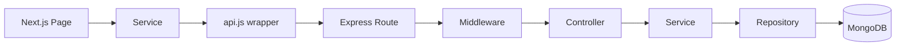

# Elevate Your English Campus — Technical Case Study

This document walks through the technical decisions behind Elevate, a full-stack LMS built as a portfolio project. Rather than listing features, it focuses on three engineering problems the project actually had to solve — how they were approached, what trade-offs each solution accepts, and what the current implementation deliberately leaves out.

The goal is to show engineering reasoning, not to market the product. Where an explanation below is an interpretation of the code rather than a documented historical decision, it is phrased objectively ("the implementation favors...", "the current design...") instead of as a first-person justification.

---

## 1. Context

Elevate Your English Campus is a full-stack Learning Management System for English-language learning, built solo as a portfolio project rather than as a product with real users. The technical goal was to build something closer to a real product than a CRUD demo: three genuinely different role-based experiences (Student, Teacher, Admin) backed by server-side authorization, a real content hierarchy with sequential progression, and a social feed that has to reconcile visibility and moderation rules across roles.

v1.0 covers a working backend (Node.js/Express/MongoDB, 20 modules, 353 tests) and a working frontend (Next.js App Router, three role-specific experiences), both deployed (Render + Vercel + MongoDB Atlas). It does not cover production-scale infrastructure, and this document is explicit about that boundary rather than implying otherwise.

---

## 2. Product & Roles

Elevate has three roles, and each one changes what the backend has to compute and authorize — not just what the UI shows.

- **Student** — sees their own progress, their own cohort's Community feed, and content gated by sequential unlock. Every read is implicitly scoped to "me" or "my cohort."
- **Teacher** — sees an aggregated view of *their own* students only. This is the role that introduced the need for cohort-scoped authorization: every endpoint a teacher touches (roster, student detail, Community moderation) has to filter by ownership, not just by role.
- **Admin** — sees everything, unscoped. Structurally, Admin is the "no filter" branch of the same authorization logic teachers use, not a separate code path.

The interesting engineering problem isn't rendering three different UIs — it's that the same underlying data (a student's progress, a Community post) has to be sliced differently depending on who's asking, and that slicing has to happen once, in one place, and be reused everywhere it matters.


---

## 3. System Architecture

Both sides of the app use a pragmatic layered architecture — not Clean Architecture, DDD, or hexagonal architecture in any strict sense, just a consistent separation of concerns repeated across every module.

**Backend**, per module:

```
route → middleware (verifyToken, requireRole, validate) → controller → service → repository → model
```

Routes wire middleware and map HTTP verbs to controller methods. Middleware handles cross-cutting concerns (auth, validation) before a request ever reaches business logic. Controllers translate HTTP in/out. Services hold the actual business rules and authorization decisions. Repositories are the only layer allowed to touch Mongoose models directly.

**Frontend**, per feature:

```
App Router page → domain components → service (lib/services/*.js) → shared API wrapper (lib/api.js)
```

Pages own data fetching and page-level state. Domain components render. Services are thin, stateless objects — one method per endpoint, no business logic. Every HTTP call funnels through a single `api.js` wrapper that attaches auth headers and normalizes errors, so no service reimplements fetch boilerplate.



---

## 4. Engineering Challenge #1 — Building a Multi-Role Community Feed

### Problem

Community is a single feed that has to unify three heterogeneous sources — unlocked achievements, issued certificates, and social content (posts and announcements) — into one chronological timeline, with visibility and moderation rules that differ by role.

### Risk

A naive implementation would duplicate scope-filtering logic across the feed, comment, and delete endpoints; trust `type` or ownership fields sent by the client; and let visibility and moderation drift out of sync with each other over time.

### Design

`CommunityPost` is a single model with a `type` field (`POST | ANNOUNCEMENT`), not two collections. Both `type` and `scopeTeacherId` — the two fields that determine what a post *is* and *who can see it* — are resolved exclusively in the service layer and are never accepted from the request body:

```js
// createPost always forces type — the body cannot decide it
const createPost = async (actorRole, actorId, { content }) => {
  const scopeTeacherId = await resolveScopeTeacherId(actorRole, actorId);
  return CommunityPostRepository.create({
    author: actorId,
    type: CommunityPost.TYPE.POST,   // never from req.body
    content,
    scopeTeacherId,                  // never from req.body
  });
};
```

Scope resolution is split into two functions because they answer different questions with the same underlying data (`assignedTeacherId`): `resolveScopeStudentIds` returns a *list of people* (used to pull achievements/certificates for the feed), while `resolveScopeTeacherId` returns a *single cohort id* (used for posts, which belong to one cohort, not a list of people). Reading a specific post — for comments, deletion, or direct access — always goes through `_assertPostAccess`, so the "can you see this?" rule is defined once and reused by every endpoint that needs it, rather than re-derived per route.

Moderation follows one rule, applied consistently: the author can always delete their own content; Admin can always delete anything; a Teacher can only delete within their own cohort. That rule is expressed once and shared between post deletion and comment deletion.

### Soft Delete

Posts and comments are never physically removed — deletion sets `isDeleted: true`. A soft-deleted or nonexistent resource returns the same `404`, so a second `DELETE` on an already-deleted post finds nothing and doesn't re-trigger side effects. `commentCount` on the parent post is updated atomically (`$inc`), and the decrement is guarded with a `commentCount > 0` filter in the same update so it can never go negative under concurrent deletes.

### Rate Limiting

A single `communityWriteLimiter` instance (100 requests / 15 min per IP) is shared across the three write endpoints — `POST /posts`, `POST /posts/:id/comments`, `POST /announcements`. It's mounted *after* `verifyToken`, so an unauthenticated request is rejected with 401 before it ever consumes quota. `GET` and `DELETE` routes carry no limiter. The limiter's counter lives in process memory, which is a deliberate scope boundary discussed in the trade-offs section below.

### Feed Aggregation

Building the feed means pulling three sources, normalizing them to one shape, and sorting by event date — but pagination happens **in memory**, after the merge, because the sort has to span all three sources at once. A defensive cap (`SCOPE_FETCH_LIMIT = 5000`) bounds the scope query. This works cleanly for a portfolio-scale dataset (dozens of users), but it is not a pattern that scales to a large academy — it's called out as a known limit in the code itself, not hidden behind the abstraction.

### Frontend Behavior

The Community page does not optimistically render a delete before the server confirms it — `handleDeletePost` awaits the `DELETE` response and only then filters the item out of local state, without a full feed refetch:

```js
async function handleDeletePost(postId) {
  await communityService.deletePost(token, postId);
  setDocs((prev) => prev.filter((d) => d.id !== postId));
  setTotal((prev) => Math.max(0, prev - 1));
}
```

A `204 No Content` response (successful delete, no body) is handled transparently by the shared `api.js` wrapper. A `429` from the rate limiter surfaces as a regular error the calling component displays inline — there is no special-case retry logic on the client, by design.

### Trade-off

The whole design favors correctness and simplicity — one authorization rule reused everywhere, no client-trusted fields — over horizontal scalability. In-memory aggregation and an in-memory rate limiter are appropriate for a single-instance demo deployment and would need to change before the feed could serve a much larger or multi-instance deployment.


---

## 5. Engineering Challenge #2 — Cohort-Scoped Authorization Without a Cohort Model

Elevate has no `Cohort` collection. A teacher's cohort is implicit: it's just every `User` document where `assignedTeacherId` points back to that teacher. This single field is the source of truth reused across Student Detail, Achievements/Certificates by student, Dashboard, and Community — the same relationship, read differently depending on what each module needs.

Authorization happens at two distinct levels, and they answer different questions:

**Route-level role authorization** (`requireRole`) — checks *what kind of user* is making the request, based only on the role encoded in the verified JWT. It has no knowledge of which specific resource is being requested.

**Data-level (cohort) authorization** (`validateTeacherScope`, and its Community equivalents `resolveScopeTeacherId`/`resolveScopeStudentIds`) — checks whether *this specific resource* belongs to *this specific actor*. It runs inside the service layer, after the route has already let the request through by role.

```js
// Route already confirmed: role is admin or teacher.
// This is the second check — does this teacher own this student?
const validateTeacherScope = async (teacherId, studentId) => {
  const student = await UserRepository.findById(studentId);
  if (!student) throw new NotFoundError('STUDENT_NOT_FOUND', '...');
  if (student.assignedTeacherId?.toString() !== teacherId.toString()) {
    throw new ForbiddenError('STUDENT_NOT_IN_COHORT', '...');
  }
};
```

Conceptually, a request for `GET /users/:id` from a Teacher flows as:

```
TEACHER token → role accepted by requireRole('admin', 'teacher')
             → service loads the requested student
             → compares student.assignedTeacherId to the teacher's own id
             → same teacher → 200
             → different teacher → 403 STUDENT_NOT_IN_COHORT
```

### UI Visibility Is Not Authorization

The frontend hides the "Usuarios" sidebar link from students and conditionally renders delete buttons in Community based on the logged-in user's role. None of that is a security boundary — it's UX. The actual authorization boundary is the backend: `requireRole` and `validateTeacherScope` run independently of anything the client sends or hides, using only the role and user id decoded from a server-verified JWT.

This is directly testable, and it is tested that way: the integration suite calls the API with Supertest, without going through any UI, and asserts a `403` when a teacher requests a student outside their cohort. If authorization only lived in the frontend, that test would be meaningless — the fact that it passes against the raw HTTP layer is the actual proof the boundary holds.

### Trade-off

Not having a `Cohort` model keeps the data model small and the v1.0 scope realistic (one teacher, one fixed group of students). The limitation is real too: there's no way to model a cohort shared by two teachers, no historical record of past cohort membership once `assignedTeacherId` changes, and no dedicated abstraction for reassigning a whole group of students at once — each student would need to be updated individually.


---

## 6. Engineering Challenge #3 — Deriving Sequential Learning State

Content in Elevate is hierarchical — `Course → Unit → Lesson` — and students are meant to progress through it in order: a lesson stays locked until the previous one is completed, and a unit stays locked until the previous unit's lessons are done **and**, if that unit has an assessment, it's been passed.

The core decision here is that **lock state is never persisted**. There is no `isLocked` field stored on a lesson or unit. It's computed on every request from `LessonProgress` records plus the declared order of lessons/units, inside a pure utility with no database access of its own:

```js
const isLessonLocked = (lesson, progressMap, unit, lessonOrderMap) => {
  if (!unit?.sequentialUnlock || lesson.order === 1) return false;
  const prevEntry = [...lessonOrderMap.entries()]
    .find(([, order]) => order === lesson.order - 1);
  if (!prevEntry) return false;
  const prevProgress = progressMap.get(prevEntry[0]);
  return !prevProgress || prevProgress.status !== 'COMPLETED';
};
```

This is a **computed derived state** approach rather than a **persisted derived state** one. The alternative — caching an `isLocked` flag and updating it whenever progress changes — would need to be kept in sync at every write site that touches `LessonProgress`, with a real risk of the flag drifting out of sync with the data it's supposed to reflect. Computing it fresh from source data on read removes that entire class of bug, at the cost of a small amount of extra computation per request — a cost that scales with one student's own progress, not with the platform as a whole, so it stays cheap in practice.


---

## 7. Testing Authorization as a Contract

Elevate's backend test suite (Jest + Supertest + `mongodb-memory-server`, 27 suites / 353 tests, run against an in-memory database rather than mocked HTTP) is not organized around chasing a coverage number — it's organized around treating each endpoint's authorization behavior as something that has to be proven, not assumed. For most endpoints, the same shape repeats: a 401 for no token, a 403 for the wrong role, a 403 for the right role but the wrong cohort, the happy path, and — where relevant — the side effect the happy path is supposed to produce.

A few examples straight out of the suite:

- `TEACHER → 403 consultando un alumno de OTRO teacher` (`users.integration.test.js`) — proves cohort scoping holds even when the role check alone would let the request through.
- `STUDENT de otra cohorte → 403 POST_FORBIDDEN` (`community.integration.test.js`) — the same cross-cohort boundary, exercised on Community's comment access path.
- `post eliminado desaparece del feed` (`community.integration.test.js`) — checks the actual effect of soft delete, not just the response status of the `DELETE` call.
- The Community rate limiter's `429` is tested by spinning up an isolated Express app with the same limiter factory and a low `max`, rather than firing hundreds of real requests against production limits — the same middleware, a shorter path to trigger it.
- `migrateNotificationStrings.test.js` tests the migration script's pure functions (planning what would change, reconstructing strings) in isolation, without running it against a real database.

The suite mixes three kinds of tests: pure-function tests (`progressCalculator`, migration planning), validation tests (`express-validator` schemas), and HTTP integration tests that exercise the full route → middleware → controller → service → repository chain. No coverage percentage is claimed anywhere in the project — none is instrumented.

---

## 8. Trade-offs and v1.0 Limitations

| Decision | Benefit | Limitation |
|---|---|---|
| `assignedTeacherId` instead of a `Cohort` model | Simple data model, fast to reason about for v1.0's fixed structure | No shared cohorts, no historical membership, no bulk reassignment |
| Community feed aggregated in memory | One combined, correctly-sorted timeline without a derived collection to keep in sync | Doesn't scale past a defensive cap (`SCOPE_FETCH_LIMIT`); not a production-scale pattern |
| In-memory, per-IP rate limiting | Zero extra infrastructure for a single-instance deployment | Resets on restart; doesn't hold a limit across multiple backend instances |
| Progress/lock state computed, not stored | Eliminates an entire class of stale-flag bugs | Slightly more computation per request than reading a cached flag |
| JavaScript instead of TypeScript | Faster iteration for a solo-built project | No compile-time contract between frontend and backend API shapes |

Beyond the table, v1.0 has a few honest scope boundaries worth naming directly, not as failures but as the current edge of what was built:

- **No TypeScript** — the entire codebase (frontend and backend) is JavaScript; API contract mismatches were caught by manually verifying responses against the live backend, not by a type system.
- **No browser-level E2E suite** — all 353 tests are backend HTTP integration tests; there is no Playwright/Cypress coverage of the actual UI.
- **Rate limiting isn't distributed** — it's a single in-process counter, fine for one instance, not for horizontal scaling.
- **Demo-grade infrastructure** — the backend runs on Render's free tier and can take a few seconds to respond after a period of inactivity (cold start).
- **The Community feed isn't built for large-scale volume** — the in-memory aggregation described above is appropriate for the dataset size this project actually has, not for an academy with a large, active student body.

---

## 9. What I Would Improve Next

If Elevate needed to grow past its current portfolio scope, these are the changes that would matter most, roughly in priority order:

1. **TypeScript across both layers** — shared types for API request/response shapes would remove an entire category of the "contract verified manually against the live backend" work described in the README, and catch shape drift at compile time instead of at runtime.
2. **Browser-level E2E tests** for the critical journeys (login → complete a lesson → pass an assessment → view a certificate) to complement the existing backend integration coverage, which currently stops at the HTTP layer.
3. **A distributed rate limiter** (Redis-backed) if the backend ever ran as more than one instance — the current in-memory limiter is correct for a single process and nothing more.
4. **A more scalable Community feed strategy** — precomputed/paginated at the database level instead of merged in memory — if the number of students, posts, or cohorts grew meaningfully past demo scale.
5. **Basic observability** beyond application logs — structured request logging and error tracking would matter well before this needed real uptime guarantees.

None of this is a backlog for the current version — it's what the next iteration would look like if Elevate's assumptions (one instance, small dataset, single developer) stopped holding.
